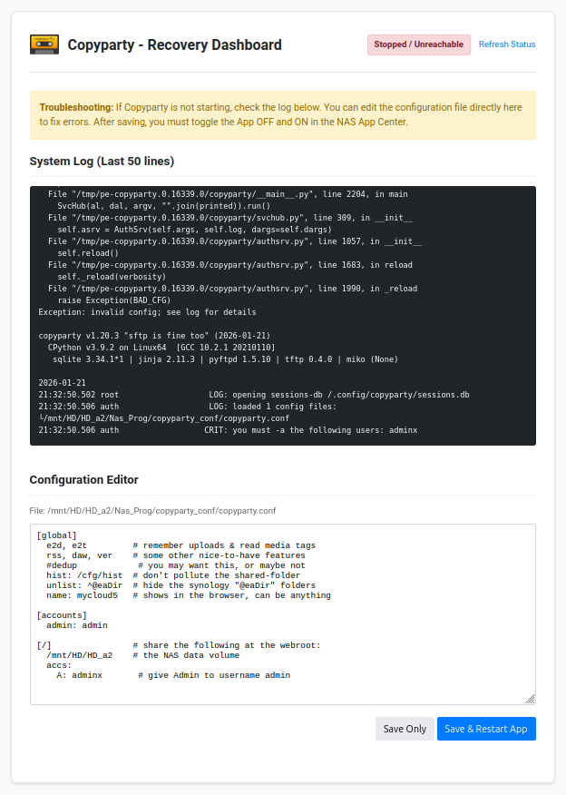
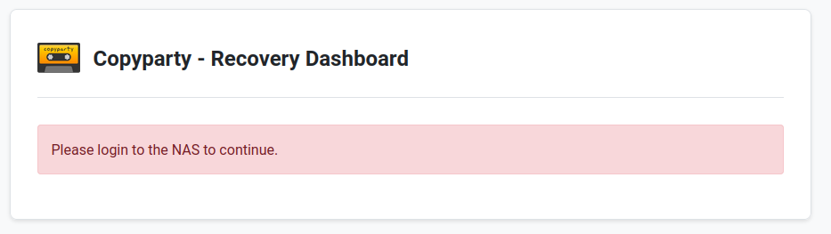

# copyparty for WD MyCloud OS5

Portable file server with accelerated resumable uploads, dedup, WebDAV, SFTP, FTP, TFTP, zeroconf, media indexer, thumbnails++ all in one file.

## Installation

1. Download the `.bin` package for your NAS model from the [releases](../../../packages/syncthing/latest) directory.
2. Install the app via the "App Store" in the WD MyCloud web interface using the "Install an app manually" option.


## Configuration
Clicking the **Configure** button will open the typical copyparty interface

- **Port**: copyparty runs on port `3923`.
- **Default Login**: `admin / admin` (configured in `copyparty.conf`).
- **Persistence**: Configuration is stored in `copyparty_conf/` on the application volume.

## Recovery
In case you edit the config file and break restarting the server, there's a recovery dashboard:


For security, the dashboard will not function if the NAS admin user is not logged in.



## Shared Folders
By default, the app shares `/mnt/HD/HD_a2` (the main data volume) at the root.


### SSH / Command Line
For advanced configuration, SSH into your NAS and navigate to the installation directory:
```bash
# The path depends on your volume name, typically:
cd /mnt/HD/HD_a2/Nas_Prog/copyparty
./tailscale up
```

## Persistent Data
Configuration is stored in `copyparty_conf/` at the root of your application installation volume to ensure it survives app upgrades.
For example, if `copyparty` is installed in:
* /mnt/HD/HD_a2/Nas_Prog/copyparty/

the persistent data is in:

* /mnt/HD/HD_a2/Nas_Prog/copyparty_conf/