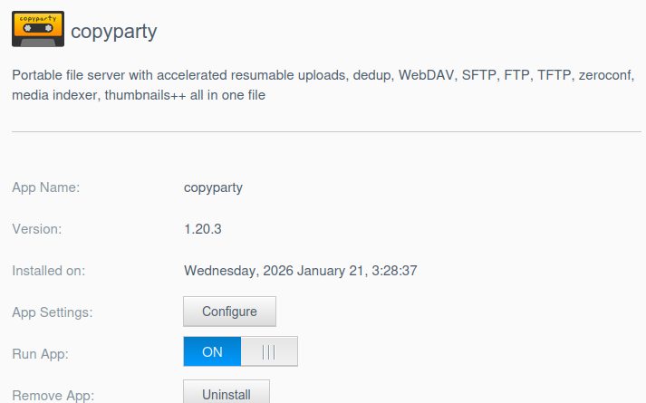
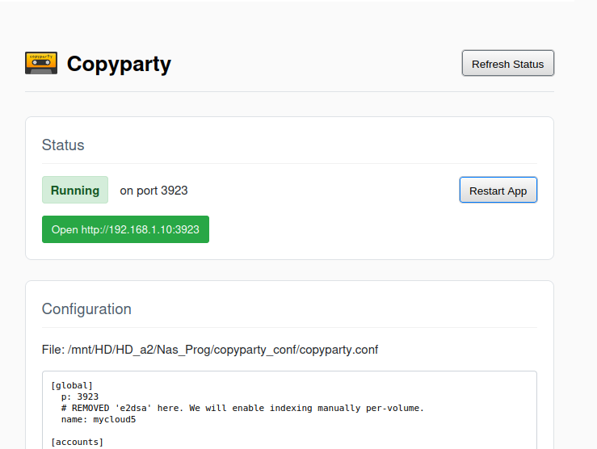
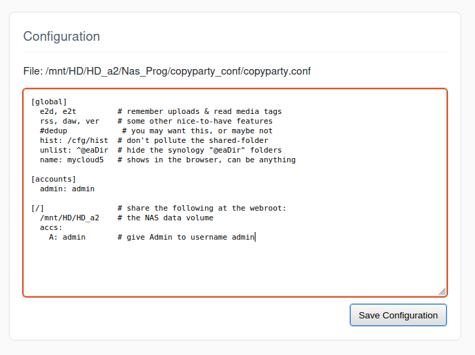
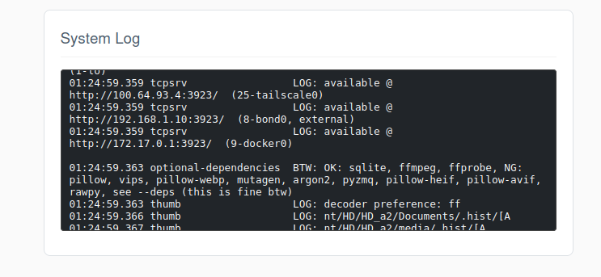

# copyparty for WD MyCloud OS5

Portable file server with accelerated resumable uploads, dedup, WebDAV, SFTP, FTP, TFTP, zeroconf, media indexer, thumbnails++ all in one file.

## Installation

1. Download the `.bin` package for your NAS model from the [releases](../../../packages/copyparty/latest) directory.
2. Install the app via the "App Store" in the WD MyCloud web interface using the "Install an app manually" option.

## Usage

Once installed, click **Configure** to access the Copyparty Dashboard built directly into the NAS web UI.

### Dashboard & Status
The dashboard shows the current status of the Copyparty server. If running, you can click the "Open Copyparty Interface" button to launch the file server in a new tab.

- **Port**: copyparty runs on port `3923`.
- **Default Login**: `admin / admin` (configured in `copyparty.conf`).

### Configuration Editor
You can edit the `copyparty.conf` file directly from the dashboard. This allows you to recover a bad config, change settings, user accounts, and shared volumes without needing SSH access.

After saving changes, click **Restart App** to apply them.

### System Log
The dashboard displays the last 50 lines of the system log, which is useful for troubleshooting startup issues or monitoring activity.

## Shared Folders
By default, the app shares `/mnt/HD/HD_a2` (the main data volume) at the root. You almost certainly don't want that, but it will get you started. You can modify this in the configuration editor.

## Persistent Data
Configuration is stored in `copyparty_conf/` at the root of your application installation volume to ensure it survives app upgrades.
For example, if `copyparty` is installed in:
* `/mnt/HD/HD_a2/Nas_Prog/copyparty/`

the persistent data is in:

* `/mnt/HD/HD_a2/Nas_Prog/copyparty_conf/`
