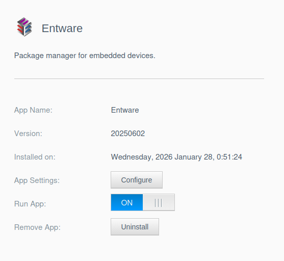
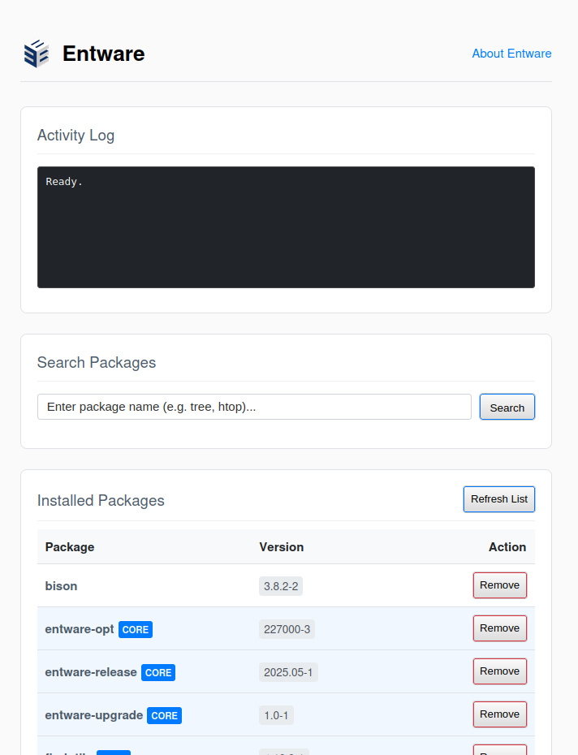
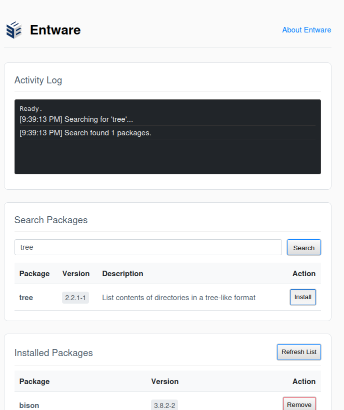

# Entware for WD MyCloud OS5

This application brings the [Entware](https://entware.net/) package manager to Western Digital MyCloud OS5 NAS devices, allowing you to install over 2000 standard Linux packages like `htop`, `git`, `vim`, `nano`, `mc`, `tmux`, and more.

## Installation

1. Download the `.bin` package for your NAS model from the [releases](../../../packages/entware/latest) directory.
2. Install the app via the "App Store" in the WD MyCloud web interface using the "Install an app manually" option.
   

## Package Management UI

Once installed, click **Configure** to access the Entware Dashboard built directly into the NAS web UI.

### Installed Packages
The dashboard automatically lists all currently installed packages.


* **CORE Packages:** Essential system packages are highlighted with a blue "CORE" badge. Removing these is generally unsafe and prompted with a strong warning.
* **Remove:** You can uninstall non-core packages by clicking the "Remove" button next to them.

### Searching and Installing
You can search for available packages using the search bar at the top.

1. Enter a package name (e.g., `htop`, `git`) and click **Search**.
2. Locate the desired package in the results table.
3. Click **Install**.
   

The "Activity Log" section will show the progress of the installation.

## CLI Usage (SSH)

For advanced usage, you should access your NAS via SSH. Entware binaries are installed to `/opt/bin` and `/opt/sbin`, which are added to your path.

```bash
# Check opkg version
opkg --version

# Update package lists
opkg update

# Install a package
opkg install htop

# Run the installed program
htop
```

## Persistent Data

The Entware root directory is located at:
`/mnt/HD/HD_{a2|b2|c2|d2}/Nas_Prog/entware_config` (dending on which drive is your primary data volume).

This directory is bind-mounted to `/opt` when the app is running. This ensures that all your installed packages and configuration files in `/opt` persist across reboots and app upgrades.

Check there for app configuration files. For example, `rclone` places it's config at `./etc/rclone.config` (/mnt/HD/HD_a2/Nas_Prog/entware_config/etc/rclone.config)
