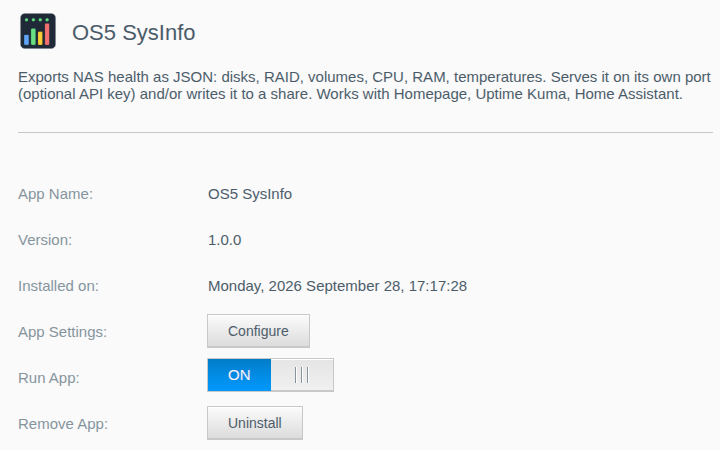
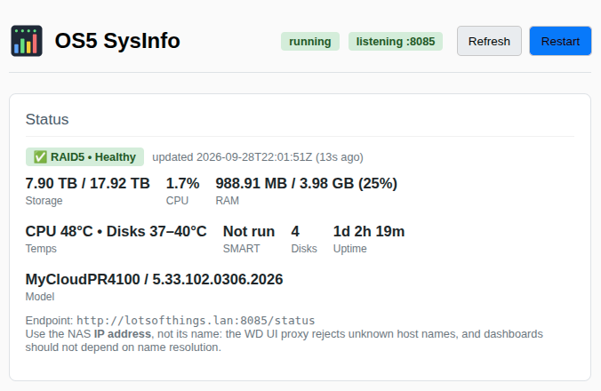
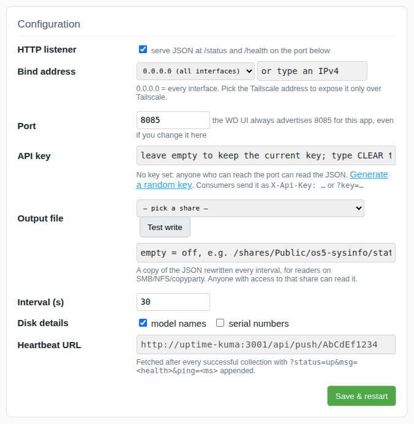
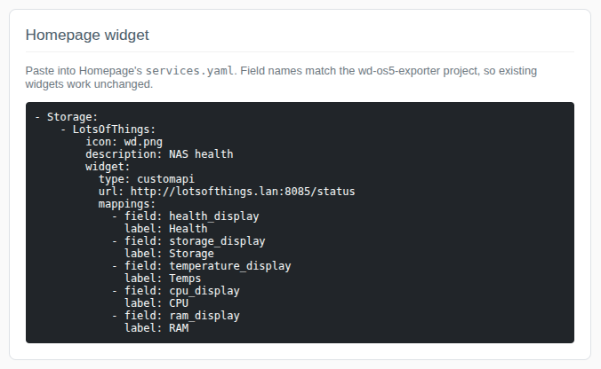
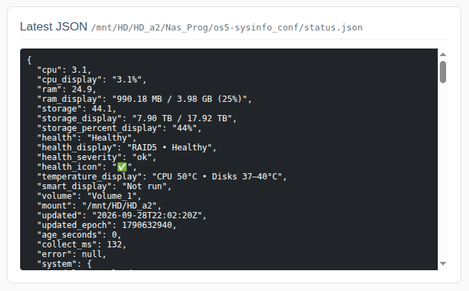
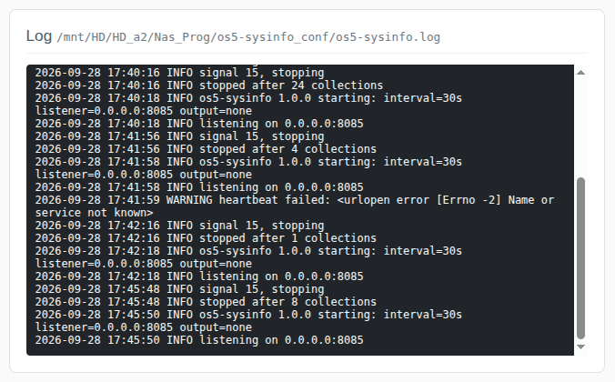

# OS5 SysInfo for WD MyCloud OS5

Exports your NAS's health as JSON: disks, RAID, volumes, CPU, RAM, temperatures, uptime. It runs on the NAS itself, so nothing else needs SSH access or a key to your NAS.

Made for dashboards and monitors: [Homepage](https://gethomepage.dev) `customapi` widgets, Uptime Kuma, Home Assistant REST sensors, or anything that can read JSON over HTTP or from a file on a share.

This is a native replacement for the container-based [wd-os5-exporter](https://github.com/fata13rorr/wd-os5-exporter), which pulled the same data over SSH with a root-equivalent key. The JSON field names are the same, so existing Homepage widgets keep working. See [Credits](#credits).

## Installation

1. Download the `.bin` package for your NAS model from the [releases](../../../packages/os5-sysinfo/latest) directory.
2. Install the app via the "App Store" in the WD MyCloud web interface using the "Install an app manually" option.
3. Make sure the app is **enabled**.



Out of the box the app serves `http://<nas-ip>:8085/status` on every interface with no key. Open the app's **Configure** page to add a key, bind it to one address, write a copy to a share, or change the interval.

Use the NAS **IP address** in every consumer, not its name. The WD UI proxy rejects unknown host names, and dashboards should not depend on name resolution anyway.

## Endpoints

| URL | Returns |
| --- | --- |
| `http://<nas-ip>:8085/status` | the full document below (200), or 503 with `error` set if the last collection failed |
| `http://<nas-ip>:8085/health` | `{status: ok/error, health, health_severity, age_seconds, error}`, 200 or 503. Good for Uptime Kuma HTTP monitors. |

With an API key set, send it as an `X-Api-Key` header or `?key=...`; anything else gets 401.

## Configure page

Click **Configure** on the app to open its page inside the NAS web UI:

- **Status**: running / listening, current health, storage, CPU, RAM, temperatures, and the endpoint URL.
- **Configuration**: listener on/off, bind address (pick your Tailscale address to expose it only over Tailscale), port, API key (with a generator), output file with a share picker and a Test write button, interval, whether disk model names and serial numbers are included, and an optional heartbeat URL. Save restarts the collector.
- **Homepage widget**: a ready-to-paste YAML snippet for your URL.
- **Latest JSON** and the **log**.











Settings live in `os5-sysinfo_conf/os5-sysinfo.conf` next to the app on your data volume and survive upgrades and removal. The file holds the API key, so keep it private.

### Output file

If you set an output file, the same JSON is rewritten there every interval. Pick a share from the dropdown to get `/shares/<share>/os5-sysinfo/status.json`, or type any path under `/shares/` or the data volume. Anyone who can read that share can read the file, so consider leaving serial numbers off. The `updated` field and file mtime tell you whether the collector is still alive.

### Heartbeat

Paste an Uptime Kuma **Push** monitor URL and the collector fetches it after every successful collection, with `?status=up&msg=<health>&ping=<collect ms>` appended. If the NAS or the collector dies, the monitor goes down on its own. Any GET-able URL works.

## Homepage example

```yaml
- Storage:
    - My Cloud:
        icon: wd.png
        description: NAS health
        widget:
          type: customapi
          url: http://192.168.1.10:8085/status
          # headers:
          #   X-Api-Key: <your key>
          mappings:
            - field: health_display
              label: Health
            - field: storage_display
              label: Storage
            - field: temperature_display
              label: Temps
            - field: cpu_display
              label: CPU
            - field: ram_display
              label: RAM
```

## The JSON

Top level, kept compatible with wd-os5-exporter:

| Field | Example |
| --- | --- |
| `cpu`, `cpu_display` | `7.3`, `"7.3%"` |
| `ram`, `ram_display` | `41.2`, `"1.61 GB / 3.91 GB (41%)"` |
| `storage`, `storage_display`, `storage_percent_display` | `44.1`, `"7.90 TB / 17.92 TB"`, `"44%"` |
| `health`, `health_severity`, `health_icon` | `"Healthy"`, `"ok"` (`ok` / `warning` / `critical` / `unknown`), `"✅"` |
| `health_display` | `"RAID5 • Healthy"`, `"RAID5 • Critical (degraded)"`, `"Disk • Healthy"` on a single-bay |
| `temperature_display` | `"CPU 45°C • Disks 37–40°C"` (CPU part omitted on models without a sensor) |
| `smart_display` | last SMART test result, or `"Not run"` |
| `volume`, `mount` | `"Volume_1"`, `"/mnt/HD/HD_a2"` |
| `updated`, `updated_epoch`, `age_seconds`, `collect_ms` | ISO-8601 UTC, epoch, seconds since, collection time |
| `error` | `null`, or a string describing partial failures |

Nested: `system` (model, firmware, hostname, uptime, load, memory, CPU temperature, per-core temperatures, listener state, output path/error), `disks[]` (one per connected disk, no cap: name, size, temperature, healthy/failed/over-temp flags, sleeping, SMART; `model` when enabled, `serial` when enabled), `raids[]` (level, state, member disks, failed/rebuilding disks, `is_system` marks WD's small internal RAID), `volumes[]` (mount, mounted/locked, size/used/free, RAID state).

Health is `Critical` for a failed disk, a RAID with failed disks or in a degraded/inactive state, or a volume that is not mounted; `Degraded` for an unhealthy or over-temperature disk, a RAID rebuilding or dirty, or storage over 90 % full; otherwise `Healthy`. If a collection fails outright the previous document is kept with `error` set and `/status` answers 503, so a transient hiccup does not flap your dashboard.

## Notes

- The WD UI always lists port 8085 for this app, even if you change the port on the Configure page.
- There is no TLS. On an untrusted network, bind to your Tailscale address or set a key.
- Firmware updates rebuild the system partition; the app is restarted by the app system on boot and its settings live on the data volume, so nothing is lost.
- ARM models (EX2 Ultra, Mirror, single-bay My Cloud) have no CPU temperature sensor exposed the same way; the field is `null` there. Everything else works the same.

## Persistent Data

`os5-sysinfo_conf/` is kept when the app is upgraded or removed. Delete it yourself for a clean slate.

## Credits

[wd-os5-exporter](https://github.com/fata13rorr/wd-os5-exporter) (MIT) worked out where WD OS5 keeps this data and how to get at it: the sysinfo xmldb, its socket at `/var/run/xmldb_sock_sysinfo`, and the `/disks`, `/raids` and `/vols` trees dumped with `xmldbc`. That is documented in its [WD-OS5-INTERNALS.md](https://github.com/fata13rorr/wd-os5-exporter/blob/main/docs/WD-OS5-INTERNALS.md) and is the foundation of this app. Its Homepage-facing field names are kept so widgets are interchangeable. No code was copied; this app's parsing, health derivation, listener and config page were written from scratch against dumps taken from a PR4100.
