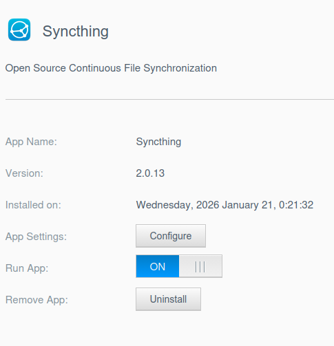
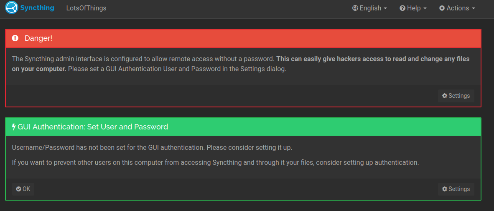
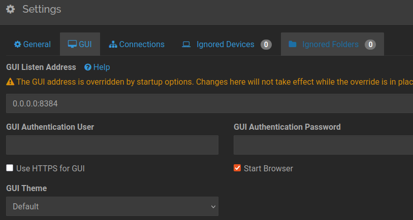

# Syncthing for WD MyCloud OS5

This application brings Syncthing to Western Digital MyCloud OS5 NAS devices.

## Installation

1. Download the `.bin` package for your NAS model from the [releases](../../../packages/syncthing/latest) directory.
2. Install the app via the "App Store" in the WD MyCloud web interface using the "Install an app manually" option.

## Configuration
After clicking configurem you'll see it's Synthing - make sure you secure it!

**Note**: It will be running on all network interfaces and currently can't be changed permanently

## Persistent Data
Configuration and database files are stored in `syncthing_conf/` at the root of your application installation volume to ensure they survive app upgrades.

For example, if `syncthing` is installed in:
* /mnt/HD/HD_a2/Nas_Prog/syncthing/

the persistent data is in:

* /mnt/HD/HD_a2/Nas_Prog/syncthing_conf/