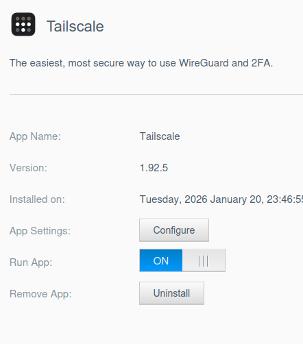
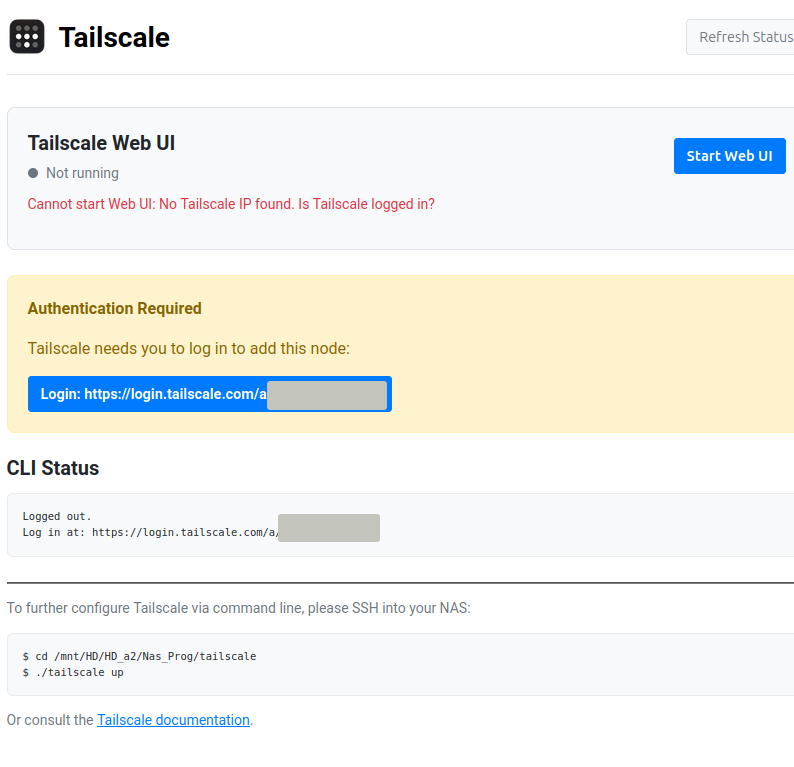
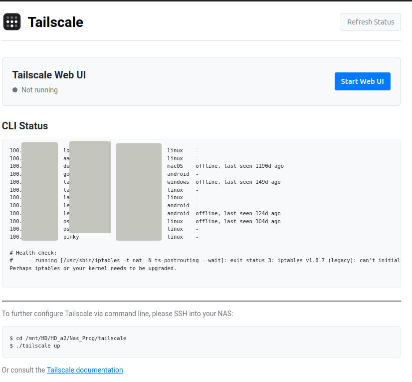
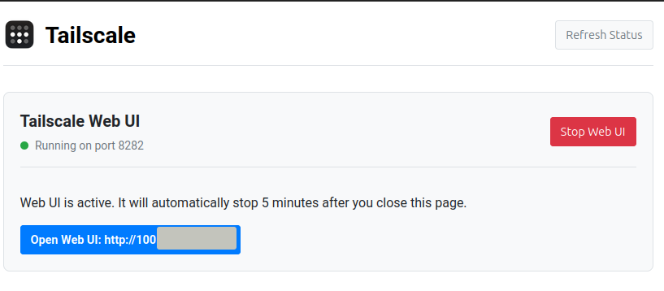
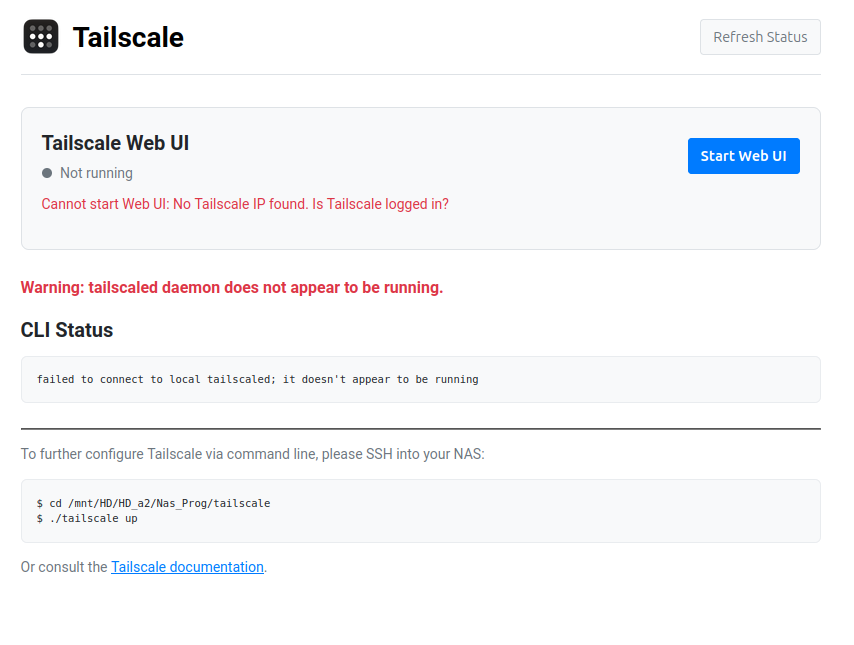

# Tailscale for WD MyCloud OS5

This application brings Tailscale to Western Digital MyCloud OS5 NAS devices.

## Installation

1. Download the `.bin` package for your NAS model from the [releases](../../../packages/tailscale/latest) directory.
2. Install the app via the "App Store" in the WD MyCloud web interface using the "Install an app manually" option:


## Setup
3. After clicking **Configure**, you'll need to login and connect the device to your tailnet.



4. Click the **Login** button and proceed through the flow to add the device to your tailnet. Once it completes, close the tab/window.
5. Click **Refresh Status** and you should see something like this:


_Note:_ for security, this is tied to the NAS login so it will stop working as frustratingly often as the NAS UI :)

## Built-in Web UI
Access to Tailscale's built-in Web UI is made easy.

6. Click "Start Web UI" to launch the built-in tailscale Web UI. Stop it manually or it will be automatically killed after <X time>.



### SSH / Command Line
For advanced configuration, SSH into your NAS and navigate to the installation directory:
```bash
# The path depends on your volume name, typically:
cd /mnt/HD/HD_a2/Nas_Prog/tailscale
./tailscale up
```

## Upgrade Problems
If you see the following, head back the the OS App and toggle it Off an back On


## Persistent Data
Configuration is stored in `tailscale_conf/` at the root of your application installation volume to ensure it survives app upgrades.
For example, if `tailscale` is installed in:
* /mnt/HD/HD_a2/Nas_Prog/tailscale/

the persistent data is in:

* /mnt/HD/HD_a2/Nas_Prog/tailscale_conf/